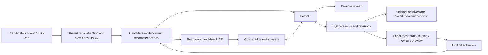

# UC4 candidate application architecture

The default runtime reads the candidate archive received on 1 October 2026. Python/FastAPI, the vanilla browser UI and the Portkey-backed question agent remain the application stack. Historical trial behavior is available only through the explicit v2 launch path or legacy test factories.

## Data and policy

`candidate_core.py` is shared by the analysis report and runtime. It loads the eight source tables, audits recorded joins, computes replicate means and then equally weighted trial means. Yield versus checks is the ratio of mean candidate yield to mean corresponding check yield. Missed-irrigation trials are excluded entirely. Check varieties support comparisons and do not become recommendation candidates.

`candidates.py` constructs views and implements AND filters. It preserves original source rows and exposes effective calculations alongside active corrections. Candidate recommendations carry snapshot hash, revision ID, rule version, unrounded metrics, criteria, reason, warnings and supplied RAG/reason. Source references retain archive member, primary key and CSV row number. Supplied and calculated RAG can diverge after enrichment; the difference is visible.

The versioned provisional policy gives AMBER first when no usable field trials exist; otherwise RED for yield <95%, disease >6 or fumonisin >4; otherwise GREEN requires yield >=103%, disease <=4, moisture <=23%, germination >=90%, fumonisin <=4, a recognized nonsusceptible marker and at least two usable trials. Remaining candidates are AMBER. Genomic value and cold test remain contextual. Threshold equality, no-data priority and weighting remain inferred policy choices pending SME confirmation.

## Durable decisions and enrichment

`candidate_history.py` stores source copies by SHA-256 and uses SQLite transactions for revisions, saved recommendations, decision events, enrichment and its review events. Each decision saves its complete recommendation context. Candidate GUIDs do not replace historical trial identity. Original legacy JSONL payloads are imported idempotently and remain read-only in the candidate application.

Decision writes use an idempotency key plus the expected recommendation and previous decision identifiers. A changed revision or concurrent decision returns a conflict. Review events retain who, what, when and why. Source corrections additionally identify the exact table, row, field, unit, observed time and evidence source. Location and source channel are required decision context; explicit unknown locations are supported.

Enrichment is contextual metadata/notes or a typed correction to an existing source measurement, genomic value/marker or operation field. Submitted drafts can be approved or rejected. An approved draft has a preview before activation. Activation appends a new evidence revision, persists its recommendations and changes the active pointer in one transaction. Corrections to shared checks or irrigation status recompute all affected candidates. Revision-wide source consistency warnings are shown during preview and in candidate evidence; they do not independently gate RAG. Repeated corrections explicitly supersede an earlier event. Rollback creates another revision; it does not delete history.

Names are self-declared in this local demo, with no authentication or separate reviewer permissions. The same person may author and review. The database is transactional, not tamper-proof against filesystem edits. Unsupported traits can be captured as notes; adding a new scoring trait requires a versioned policy/code change.

## Interfaces and grounding

`candidate_api.py` serves candidate lists, exports, details, historical context and explicit mutation routes. The browser loads all result pages, displays AND filters and source evidence, and requests review/activation through the API. It keeps request IDs for safe decision retries. Original trial URLs return migration errors in current mode.

`candidate_server.py` exposes candidate lookup, scoring, list queries, policy and source tools. All tools are read-only; old trial-scoring names return migration messages. Candidate and historical agents select instructions from the available tool contracts. Grounding recognizes candidate RAG, breeder actions and source/tool citations. Snapshot/revision context and supplied-versus-calculated results stay distinct in tool output.

Offline tests exercise the baseline, thresholds, filters, API/MCP contracts, stale writes, legacy imports, reviews, shared-check effects and historical modes. Browser tests exercise actual candidate workflows. Live-model tests remain opt-in and use the new candidate evaluation set. See [run and test instructions](README.md).
