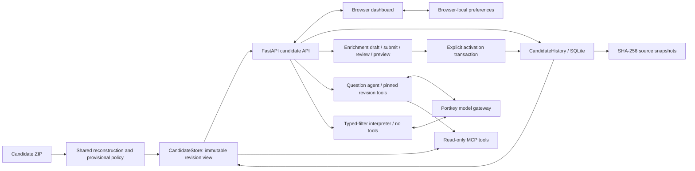

# UC4 candidate application architecture

The current runtime reads the candidate delivery received on 1 October 2026. Python/FastAPI serves a vanilla JavaScript dashboard and HTTP API. Deterministic code reconstructs evidence and scores candidates; the Portkey-backed agent explains retrieved evidence. Historical trial behavior uses an explicit v2 launch path.

## Components and data flow

| Component | Responsibility |
| --- | --- |
| `candidate_core.py` | Shared analysis/runtime source loading, joins, reconstruction and provisional scoring |
| `candidates.py` | Candidate views, source evidence, assessments, AND filtering and sorting |
| `candidate_history.py` | Snapshot copies, SQLite recommendations, revisions, decision/enrichment events and legacy imports |
| `candidate_api.py` | Dashboard routes, validation, explicit writes, CSV, filter proposals and scoped Ask |
| `candidate_server.py` | Read-only MCP contracts over current or pinned candidate evidence |
| `agent.py`, `bridge.py`, `grounding.py`, `llm.py` | Tool orchestration, citation verification and configured gateway access |
| `demo_runtime.py` | Isolated loopback server, owned socket, HTTP readiness and bounded shutdown for verification |

`uc4-ask serve` serves the dashboard/API on loopback port 8766. `uc4-mcp` independently exposes stdio or HTTP MCP (default HTTP port 8765). Both load the root `.env`; existing environment values win. `app/agent.toml` supplies model/agent defaults. Core workflows need no model configuration. Health exposes source/revision identity and configured model; it does not contact the gateway.

## Evidence and provisional policy

Eight source tables preserve archive member, primary key and CSV row references. `candidate_core.py` computes replicate means and then equally weighted usable-trial means. Yield versus checks is the ratio of mean candidate yield to mean corresponding check yield. Missed-irrigation trials are excluded entirely. The two check varieties support comparisons and do not become recommendation candidates. Lab values remain material-level because no trial relationship is supplied.

The policy is `CANDIDATE_PROVISIONAL_V1`:

- No usable field trials: AMBER takes priority.
- Otherwise RED if yield <95%, disease >6 or fumonisin >4 ppm.
- Otherwise GREEN requires yield >=103%, disease <=4, moisture <=23%, germination >=90%, fumonisin <=4 ppm, a RESISTANT or INTERMEDIATE marker, and at least two usable trials.
- Other candidates are AMBER. Moisture >25% and germination <85% are warnings. Genomic breeding value and cold-test vigour are contextual.

Candidate recommendations carry snapshot hash, revision ID, rule version, unrounded metrics, criteria, reason, warnings and supplied RAG/reason. Assessments expose units, signed margins (observed minus threshold), status and missing evidence. Presentation rounding does not alter scoring. Supplied RAG, calculated RAG and breeder decisions are separate facts. The baseline reproduces 150 candidates: 32 GREEN, 53 AMBER and 65 RED. This verifies implementation consistency; weighting, threshold equality and crop applicability remain provisional pending SME validation.

## Durable decisions and revisions

Source archives are copied under `snapshots/` beside the SQLite database and addressed by SHA-256. SQLite transactions retain revisions, complete saved recommendations, decision events, enrichment drafts and review events. Each decision captures its exact recommendation/evidence context. Original legacy JSONL payloads are imported idempotently and remain read-only in the candidate application.

Decision writes include a request ID, expected recommendation ID and expected previous-decision ID. Repeating the same confirmation is idempotent. A changed recommendation or concurrent decision returns 409 for refresh and fresh review. The browser retains the request ID during retries, renders a saved receipt after success, and requires **Record another decision** for a later event. Selecting another candidate or loading a saved decision does not submit a new event.

Enrichment follows draft -> submitted -> approved/rejected. Approved additions have a read-only impact preview before explicit activation. Corrections identify the exact source row/field/unit, observed time, evidence source and rationale. Activation recomputes affected candidates, persists recommendations and moves the active revision pointer in one transaction. Shared-check or irrigation corrections can affect several candidates. Stale preview activation returns 409. Source consistency warnings remain visible but do not independently change RAG. Further corrections explicitly supersede the earlier active addition; notes accumulate. Rollback creates a new revision rather than deleting history.

Changing the configured compatible archive selects its baseline on restart while preserving previous revisions and decisions. Earlier revision views reconstruct from their own snapshot. Back up the stopped database and its snapshot directory together; see [process guide](PROCESS.md#backup-and-restore).

## Browser behavior and AI boundaries

The browser uses `candidate.js` for list loading, filters, selection, decision confirmation and tabs. `enrichment.js` implements guided drafts and review/activation. `evidence-ui.js` renders source tables, original decision evidence and Ask citations in a shared dialog. `usability.js` adds glossary help, rule assessments, chips and the persistent Ask entry. `filter-intent.js` manages proposal/edit/validate/apply; `preferences.js` handles opt-in local storage. These scripts share page state and load in the order declared by the candidate HTML.

The browser loads every matching result page and exports all matching rows. Candidate detail has Evidence, Decision, History and Enrichment tabs with keyboard and mobile navigation. Dialog Back/Close preserves unsaved inputs. Ask presents a concise opening answer with expandable detail and citations. Identity and the system recommendation remain visible across detail tabs.

Browser preferences are stored under `uc4.preferences` at the current origin. Saved defaults contain self-declared identity/context; optional resume state contains filters, ranges, sorting, selected candidate and snapshot identity. A changed dataset invalidates resume state. Decision/evidence drafts and AI requests/previews are not stored there. Reset clears the view; Forget removes defaults and resume state. These values are neither accounts nor server-side identity.

Ask captures a revision at request start and builds MCP tools pinned to that immutable store. Selected candidate context resolves phrases such as "this candidate"; explicit candidate names take precedence. Responses retain context, tool results, citations, grounding problems and the disclaimer. Citations open captured response evidence, even after selection/revision changes. The model can request only read-only tools and cannot record decisions, activate corrections or edit scoring.

The browser accepts one Ask request at a time. Error answers and service/network failures show a plain-language unavailable state, preserve the question and allow a later retry while manual review remains usable. HTTP 200 with answer `status: error` is a failed Ask; clients must inspect status. Health reports model configuration rather than gateway availability.

Typed filter interpretation sends only the request and filter definitions to the model, with no tools. Strictly validated proposals return for human editing. The browser explicitly validates the proposal against its snapshot/revision before Apply. Apply uses existing candidate query/export contracts. Interpretation failures leave manual filters usable; proposals never write history. [API reference](API.md) defines the supported fields, units and errors.

## Verification and operating limits

Offline tests cover data reconstruction, policy boundaries, API/MCP, stale writes, retry identity, legacy imports, review/activation and historical modes. Candidate browser tests use isolated history, fresh browser contexts and matching Playwright Chromium. The runtime retains ownership of its socket and polls HTTP health after evidence initialization. Live tests are opt-in; the filter evaluation checks supported and rejected requests, and the isolated live walkthrough checks grounded Ask and original evidence reopening.

Names are self-declared, with no authentication or separate reviewer permissions; an author may approve their own addition. SQLite provides transactional history, not tamper resistance against filesystem editing. The app is a local demonstration. Voice, natural-language writes, configurable biological policy and hosted multi-user operations remain deferred. Technical results and outstanding human checks are recorded in the repository handoff; [README](README.md) and [process guide](PROCESS.md) provide reproducible commands.
