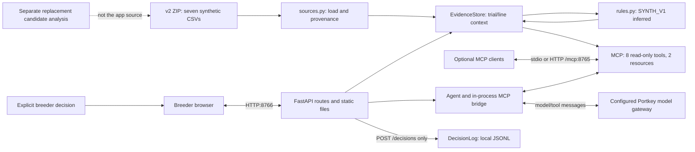
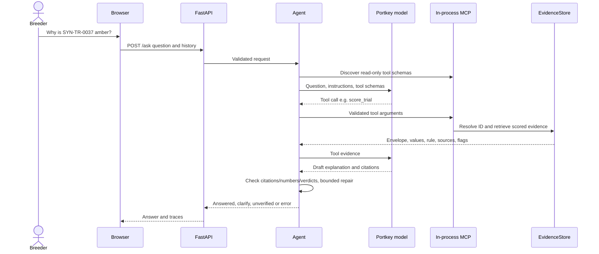
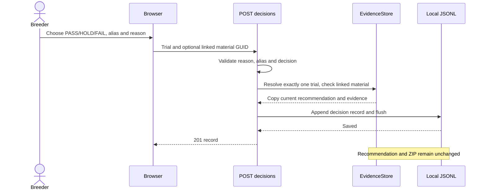

> Archived v2 documentation. Use the explicit `--historical-v2` launch flag described in [current instructions](README.md); the default launch now uses candidate data.

# UC4 implemented architecture

Current implementation reviewed 2026-09-30. The demo uses the **v2** synthetic archive. The [current replacement candidate analysis](../analysis/uc4_eda/report.html) uses different schemas and candidate-level GREEN/AMBER/RED; it is not implemented by this historical v2 app. The [v3 analysis](../analysis/uc4_eda/v3/report_v3.html) is superseded historical evidence. See [review evidence and readiness](../.tasks/uc4-demo-review/task.md), [v2 data model](../use-cases/uc4/DATA_ARCHITECTURE_v2.md), and [run instructions](README.md).

## Components and stack

| Component | Implementation | Responsibility |
| --- | --- | --- |
| Runtime/package management | Python >=3.12, uv; declared ranges in pyproject.toml | Local console entry points `uc4-mcp` and `uc4-ask`; resolved versions recorded per review run. |
| Source and evidence | zipfile, pandas; sources.py and store.py | Read seven CSVs directly from a ZIP; retain CSV member, row ID and line number; construct trial/line context and consistency flags. |
| Scoring | rules.py, SYNTH_V1 | Infer fixed cut-points; deterministic PASS/HOLD/FAIL at trial scope, with five PASS criteria and two knockouts. |
| MCP | mcp SDK; server.py | Eight read-only tools and two JSON resources. stdio or streamable HTTP `/mcp` on 8765. |
| Agent | bridge.py, agent.py, grounding.py, llm.py | In-process MCP client; OpenAI-compatible client through configured Portkey gateway; bounded tool rounds, citations and repair. |
| Web/API | FastAPI, uvicorn; api.py | Static breeder page, trial/line reads, Ask, explicit decisions; default localhost:8766. |
| Browser | HTML, CSS, JavaScript | Render evidence, clarify identifiers, show answers and submit explicit breeder choices. |
| Decisions | decisions.py, models.py | Local JSONL append with copied recommendation, reason, demo alias and UTC timestamp; separate from source data. |

No database, training pipeline, n8n workflow, cloud deployment, or live research-system integration is implemented here. OpenCode, Claude Code and n8n are documented optional MCP clients.

## Data, scoring and provenance

The exact v2 default filename is `get_started/RE__Hatchworks_Hackathon_-_4th_Use_Case.zip`. `UC4_ZIP` explicitly overrides it; it does not migrate the schema. Version compatibility is checked by the loader. Archives are git-ignored and must be obtained from the supplied local materials or a teammate with approved access.

Recommendations join trials by `TRIAL_GUID`. v2 observations link trials by `ATTACHED_TO_FIELD_ENTITY_ID` and lines by `GID`; they contain no field trait measurements. Genomics/lab attach to lines by `MATERIAL_GUID`; lab has no trial key or trait dictionary. Trial aggregate values come from recommendations, not a reconstruction of observation-linked lines. Genomics reconciliation flags expose discrepancies rather than repair the supplied membership silently.

The inferred rule is FAIL for yield <7 t/ha or disease >7; otherwise PASS requires yield >=9, moisture <=22%, disease <=5, mean GBV >=102, and resistant material >=50%; otherwise HOLD. Missing criteria cannot earn PASS. Height and flowering are shown as context and do not set this score. Matching the synthetic baseline does not confirm thresholds or validate a biological advancement decision.

CSV evidence is cited as `[source_file#row_id]`; aggregate tool results can use `[tool:query_trials]` or another tool reference. Derived criteria carry rule/threshold information. These are different sources of justification and must remain identifiable.

## Question and decision flows

Ambiguous identifiers return candidate lists; absence stays missing. Numeric/citation checks provide a guard, not a full semantic proof: a real value may still be attributed to the wrong trait/entity, and a supported answer may omit part of the request. Review evidence includes semantic checks. Only retrieved evidence supports answer quantities; the question itself is not a factual numeric source.

```mermaid
stateDiagram-v2
    [*] --> Recommendation: deterministic score
    Recommendation --> Displayed: PASS/HOLD/FAIL and evidence
    Displayed --> Accepted: explicit same verdict and reason
    Displayed --> Overridden: explicit different verdict and reason
    Accepted --> History: copied recommendation plus choice
    Overridden --> History: copied recommendation plus choice
    History --> Displayed: read history; original score unchanged
```

Decision records contain `decision_id`, `trial_guid`, `trial_id`, optional `material_guid`, the copied `recommendation`, `decision`, `overrides`, `reason`, `user`, and server UTC `timestamp`. Optional material only annotates a trial decision; it is not a per-line score. `UC4_DECISION_LOG` overrides the default `app/data/decisions.jsonl`. Rehearsals use fresh isolated logs.

## Assumptions, limits and records

The server has no authentication. `user` is a demo alias, and JSONL is append-only through this API; it is neither tamper-proof nor a multi-process transactional audit database. No model/tool path records a breeder decision. Binding to all interfaces is a separately documented local-client choice, not a production deployment.

Business/source assumptions and technical choices are documented in [review assumptions](../.tasks/uc4-demo-review/evidence/20260930T225928Z-bbd0c0b/docs/assumptions.md) and [technical decisions](../.tasks/uc4-demo-review/evidence/20260930T225928Z-bbd0c0b/decisions.md). Each technical choice records context, alternatives, evidence, decision-maker, consequences, and supersession. Breeder decisions are instead the application JSONL records described above. [SME answers](../team/SME_ANSWERS.md) record external statements and unresolved questions; [prompt log](../team/PROMPT_LOG.md) records retained AI development prompts.

## Review and reproduction

Default pytest excludes browser/live checks. Run analysis, offline application, trusted browser input and live-model evaluation as separate lanes, preserving failures/skips. Follow [demo review tasks](../.tasks/uc4-demo-review/task.md) for source-to-screen comparisons, video provenance, and final readiness. Historical [Phase 3 evidence](../team/phase3_walkthrough.md) remains dated historical evidence. Recordings supplement the handbook-required live event presentation.
