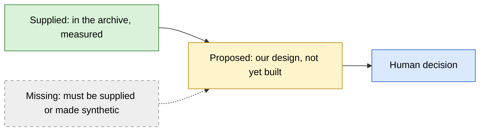
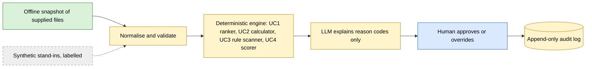

# Data architecture: all four use cases

This checkout contains the UC4 data-architecture page and [implemented runtime architecture](../app/ARCHITECTURE.md). The UC1-UC3 rows below preserve historical design summaries; their diagram files are absent here. The UC4 data page has these layers:

- **For the breeder:** how field measurements, checks, lab results and genomics inform a candidate recommendation.
- **Recorded source relationships:** explicit GUID/entry joins, cardinality safeguards and measured audits.
- **Analysis flow and migration boundary:** reconstruction, source limitations and differences from the historical app.

| Use case | Page | Data backbone | Biggest data gap |
| --- | --- | --- | --- |
| UC1 Plant Capacity | Historical summary; page absent | `PO Number` links schedules → logs → pass/fail, in two separate LSV and SSV clusters | No line capacity, customer orders or changeover rules |
| UC2 Market Intelligence | Historical summary; page absent | Market ↔ Sales on Species + Year (236 of 236) + segment **description** | No monthly demand history; units unconfirmed |
| UC3 Data Integrity | Historical summary; page absent | One 545-row account table with 3 unique ID columns | No required-field policy or owner directory |
| UC4 R&D Unification | [uc4/DATA_ARCHITECTURE.md](uc4/DATA_ARCHITECTURE.md) | Replacement: candidate MATERIAL_GUID, explicit replicated-entry bridge and trait dictionary; all 12 audited relationships resolve | Trial master/status/location, confirmed aggregation and threshold boundary policy |

## Legend

The historical data/proposal diagrams use the colours below. The current app architecture labels actual runtime components directly.

A solid arrow is a join or flow that was measured. A dashed arrow is an input or join that does not yet exist or does not work without extra mapping.

## One pattern shared by all four

The historical proposal shared this shape across four use cases. In the implemented UC4 app, deterministic rules produce a recommendation, the agent retrieves evidence and phrases explanations, and an explicit breeder action records the final choice. The use cases differ in what the engine does and in which inputs are missing.

## Historical findings (29 September 2026)

These findings describe the earlier deliveries, opened read-only on 2026-09-29. The UC4 rows below apply only to historical v2. For the current candidate dataset, use the [UC4 guide](uc4/README.md) and [data architecture](uc4/DATA_ARCHITECTURE.md).

| UC | Finding | Why it matters |
| --- | --- | --- |
| UC1 | LSV and SSV share no PO numbers. 99.5% of LSV log POs appear in an LSV schedule. Pass/fail grain is PO + Lot + Size Fraction. SSV has no test log. | There are two planning domains. A failed test blocks a fraction. The failed-test demo is LSV-only. |
| UC1 | SAP `WorkCenter` codes (`LSVLN1`, `SSVLN5` …) map to schedule tabs; `Equipment ID` does not. | Build the line crosswalk from WorkCenter. |
| UC2 | Micro-segment codes do not join between market and sales (0 shared); descriptions do (393 of 393). | Join on the description, or aggregate to species. |
| UC2 | Market, sales and grower files each cover a single geography value (Spain). | "One geography" = Spain. `Spain Geo` is not needed for the MVP. |
| UC4 | The SME's v2 archive (2026-09-29) scores each **trial** PASS/HOLD/FAIL. Fixed thresholds reproduce all 72 verdicts; one criterion (resistant %) is missing from the rationale text. | Score trials with a versioned engine and show every value against its threshold. Use the supplied verdicts as the regression baseline. |
| UC4 | v2 observations hold links, not values; trial genomics aggregates match the linked lines in 0 of 72 trials. | Line-level evidence cannot prove a trial verdict. Flag the gap instead of hiding it. |
| UC4 | 144 of 216 operations fall outside their trial's start year; all 114 planned operations are already past. | Show operations as context with a date-inconsistency flag. |

The first-pass UC4 findings (one trait per material, 29 of 216 operations sharing an observation, replication labels) described the kickoff archive, which v2 superseded. Both are superseded for current UC4 work by the 1 October candidate delivery.
