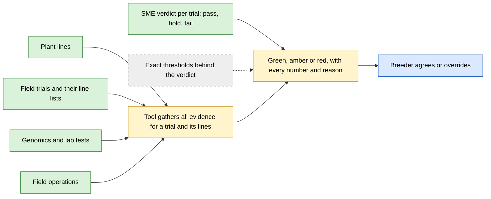
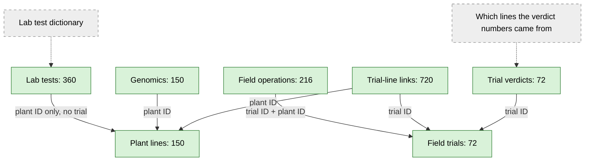
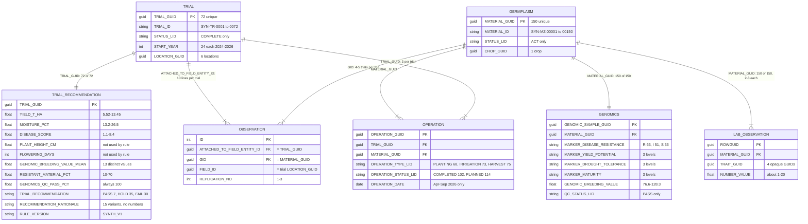
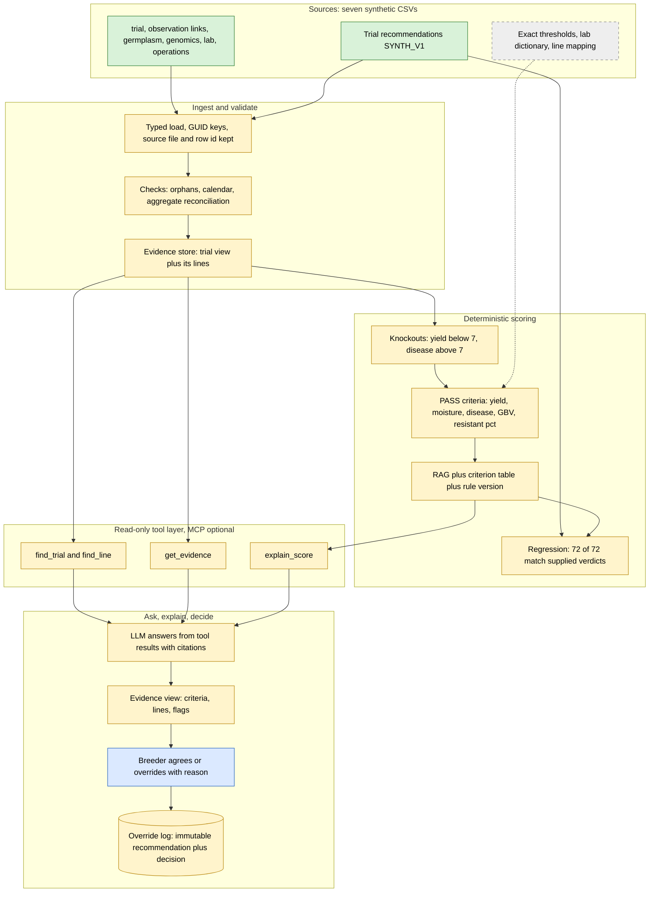
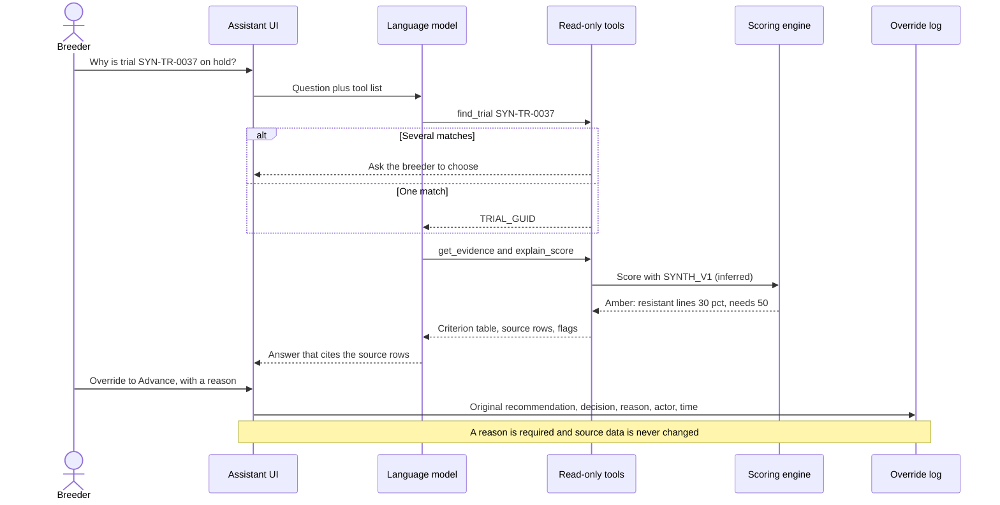
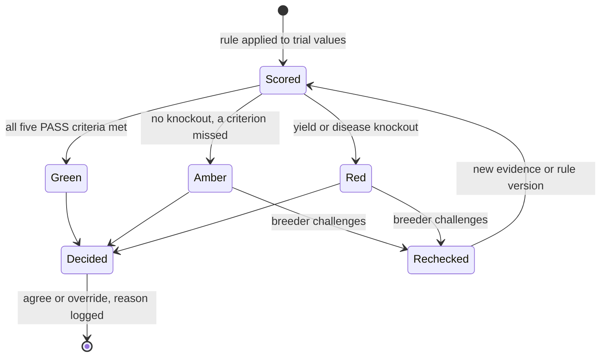

# UC4 data architecture: R&D Data Source Unification

This page explains how the supplied UC4 data fits together, first in plain language (Part A) and then at column, key and pipeline level (Part B). Every number comes from the **v2 archive** the UC4 SME sent on 2026-09-29 ([SME answer][sme]; see [Part C](#part-c-evidence)). All seven files are **synthetic**. The target design is the **Proposal** in the [UC4 guide](README.md#proposed-hackathon-mvp). Colour legend: see [the index](../DATA_ARCHITECTURE.md#legend).

---

## Part A: For a novice

### The story in four sentences

A breeder wants to know whether plant lines tested together in a **field trial** should move forward. The SME has already scored every trial **pass, hold or fail** from its yield, moisture, disease and genomics results, but the file says only *that* a trial passed, not the numbers it had to beat. The tool recomputes each verdict with fixed thresholds, shows every value against its threshold, and links the trial to its ten plant lines, their genomics, lab tests and field operations. It shows a green, amber or red signal with its reasons, and the breeder makes the final call, which is recorded.

### Where the data goes

### What connects to what

**What to remember:** the IDs join perfectly, with no broken links. The verdict belongs to a **trial**, not a plant. Yield, moisture and disease exist only as one number per trial. The trial's genomics numbers do not match the plants the files link to it. So the tool can explain *why a trial* passed, but cannot yet prove which plants' results produced that verdict.

---

## Part B: For an expert

### Entity-relationship model (as supplied)

Relationship labels show the join key and the measured coverage.

**Key findings that shape the model**

| Finding | Consequence for the design |
| --- | --- |
| Zero orphans across all seven files; every GUID resolves. | Joins are safe. |
| The verdict grain is the **trial**: one PASS/HOLD/FAIL per trial, 10 lines per trial, 4-5 trials per line. | Score trials. A line inherits 4-5 trial verdicts; how to combine them is an SME question. |
| An inferred fixed-threshold rule reproduces **72 of 72** verdicts. Cut-points are bracketed only (e.g. yield target 8.90-9.14). | Implement it as a versioned engine ("SYNTH_V1, inferred"). Use the supplied verdict as the regression baseline. |
| The rationale omits the resistant-% criterion; 4 "all met" trials are HOLD. | The engine's explanation, not the supplied text, must be what the breeder sees. |
| Observations carry **no values**. Yield, moisture, disease, height and flowering exist only per trial. | No line-level field evidence can be shown. Say so rather than invent it. |
| Trial GBV mean matches the observation-linked lines in **0 of 72** trials, resistant % in 10 of 72. Consecutive blocks of 10 lines by ID reproduce all 72. | The trial-to-line link used for evidence differs from the one behind the numbers. Flag it on every trial view until the SME resolves it. |
| Operations: 144 of 216 outside their trial's start year; all 114 PLANNED already past; 60 of 72 COMPLETE trials still have planned work. | Show operations as context with a "dates inconsistent" flag; never use them as proof of what happened in the trial. |
| Lab: 4 unnamed traits, roughly uniform values, no dates; not used by the rule. | Show as unexplained line-level context. |
| v1's `ADVANCEMENT_DECISION`, pedigree, stage and quality flags are gone. | The v1 baseline and the "missing lab" / "REVIEW" amber cases no longer exist. |

### Target data architecture (proposal)

### Headline interaction: ask, see the reasons, override

### Recommendation and override lifecycle

### Data gaps to close before any operational claim

| Needed | Supplied? | Stop-gap for the demo |
| --- | --- | --- |
| Pass/fail scoring logic | **Yes, as outcomes** (`SYNTH_V1`), no thresholds | Inferred thresholds that reproduce 72/72, labelled "inferred" |
| Colour meaning | PASS / HOLD / FAIL | Proposed mapping to green / amber / red |
| Line-level field measurements | No: observations hold links only | Show trial values; state that line values are not supplied |
| Which lines produced each trial aggregate | No: observation links do not reproduce them | Flag the mismatch; ask the SME |
| Lab trait dictionary | No | Label as Lab trait 1-4 |
| Past decision baseline per line | Removed in v2 | Use the supplied trial verdicts as the baseline |

Open questions for the SME are in the [UC4 guide](README.md#questions-for-the-domain-owner).

---

## Part C: Evidence

Method: the v2 zip was opened in memory with `zipfile` + `pandas.read_csv` (read-only, 2026-09-29) by [`analysis/uc4_eda/`](../../analysis/uc4_eda/uc4_eda.py); the tables it writes are in `analysis/uc4_eda/tables/`.

| Claim | Source | Measured value |
| --- | --- | --- |
| Row × column counts | 7 CSVs | recommendations 72×18, genomics 150×19, trial 72×56, observation 720×17, operations 216×10, lab 360×16, germplasm 150×64 |
| Orphan keys | all GUID joins | none |
| Lines per trial; trials per line | observation | 10 in every trial; 4 (30 lines) or 5 (120 lines) |
| Observation location = trial location | `FIELD_ID` vs `LOCATION_GUID` | 100% |
| Verdicts | `TRIAL_RECOMMENDATION` | PASS 7, HOLD 35, FAIL 30; `RULE_VERSION` SYNTH_V1 |
| Inferred rule reproduces verdicts | `rules.apply_rule` | 72 of 72 |
| Cut-point brackets | `tables/rule_intervals.csv` | yield target 8.90-9.14; moisture 21.8-22.1; disease 4.9-5.2; GBV 101.0-103.4; resistant 30-50; yield KO 6.72-7.13; disease KO 7.0-7.2 |
| "All four met" but not PASS | rationale vs verdict | 4 of 11 |
| FAIL triggers | knockouts | disease only 16, yield only 10, both 4 |
| Genomics aggregates via observation links | `tables/genomics_reconciliation.csv` | GBV 0 of 72, resistant 10 of 72 |
| Genomics aggregates via blocks of 10 lines | same | 72 of 72 each |
| Operations outside trial start year | operations vs trial | 144 of 216 |
| Planned operations before the extract (26 Sep 2026) | operations | 114 of 114 |
| COMPLETE trials with planned operations | operations | 60 of 72 |
| Operations sharing trial + line with an observation link | operations vs observation | 85 of 216 |
| Lab coverage | lab | 150 lines, 2-3 rows each; 4 traits × 90 rows; no dates |
| Genomics QC | `QC_STATUS_LID` | PASS 150 |

The kickoff (v1) archive evidence is superseded; its profile remains in [`analysis/uc4_eda/v1/`](../../analysis/uc4_eda/v1/report_v1.html).

[sme]: ../../team/SME_ANSWERS.md
