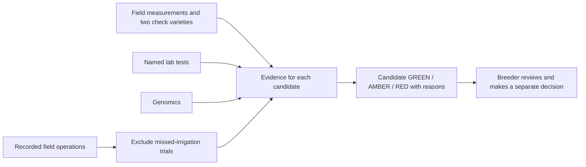
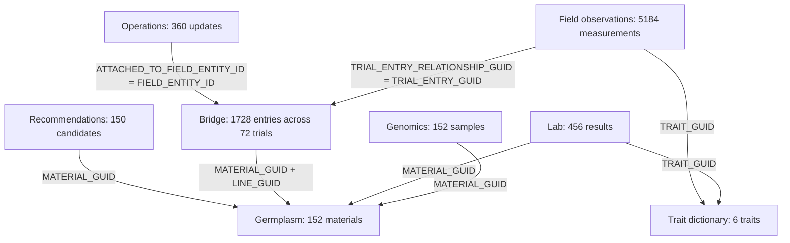

# UC4 replacement data architecture

This describes the replacement candidate dataset received 1 October 2026, measured in the [current briefing](../../analysis/uc4_eda/report.html). All data are synthetic. The [implemented app architecture](../../app/ARCHITECTURE.md) describes the candidate runtime, reviewed enrichment and historical decision preservation. The former data diagrams are retained in [DATA_ARCHITECTURE_v2.md](DATA_ARCHITECTURE_v2.md).

## For the breeder

Field measurements, lab tests and genomics now connect to individual candidates. Two check varieties provide the yield comparison. Recorded irrigation failures reduce usable evidence; the system recommendation and a human breeder decision remain separate.

## Recorded source relationships

Operation-to-bridge arrows represent a trial-level relationship, not a raw many-to-many merge. Deduplicate the bridge to a unique FIELD_ENTITY_ID/TRIAL_GUID map before joining operation updates. Observation-to-bridge joins validate many-to-one cardinality. Material joins validate against unique MATERIAL_GUID records; repeated MATERIAL_ID and LINE_GUID attributes are cross-checked.

TRIAL_GUID differs from FIELD_ENTITY_ID. In observations, FIELD_ID equals bridge TRIAL_GUID, ATTACHED_TO_FIELD_ENTITY_ID equals bridge FIELD_ENTITY_ID, and GID equals MATERIAL_GUID. Resolve each observation by its entry relationship first and cross-check the other keys; do not infer namespaces from column labels.

## Analysis flow and evidence

- Resolve trait labels/units through the dictionary, and attach source CSV member and line number before any aggregation.
- Average the three replicates per material/trial. Identify check entries by ENTRY_ROLE_LID = CHECK; candidate entries use TRIAL_ENTRY.
- Identify five trials with MISSED irrigation. Exclude their measurements from candidate summaries; reconcile N_TRIALS, N_TRIALS_USED and the 30 exclusion caveats.
- Compute equal-trial-weight field means, and yield relative to checks as a ratio of mean yields. Join material-level lab/genomic evidence directly; do not duplicate it per field row.
- Compare rebuilt values with all 150 supplied candidate rows using source precision. Audit the outcome-compatible RAG rule separately from supplied reasons and a human decision.

All 12 audited relationships resolve, and all 22 identity/chronology checks have zero violations. Candidate field metrics reconcile for 148 lines; two untested candidates retain missing field values. The supplied and rebuilt metrics both reproduce all 150 RAG values with the inferred rule.

## Missing information and migration boundary

There is no trial master, official trial year/status/location, plot observation date or complete pedigree/stage. The bridge supplies trial identity and membership, not those missing attributes. Old archives do not fill missing current evidence.

The runtime and analysis share the candidate reconstruction implementation. The app adds versioned evidence overlays and immutable recommendation/decision records. Historical v2 trial-level PASS/HOLD/FAIL records retain their original scope and copied recommendation; the separate historical launch path uses the v2 archive.
